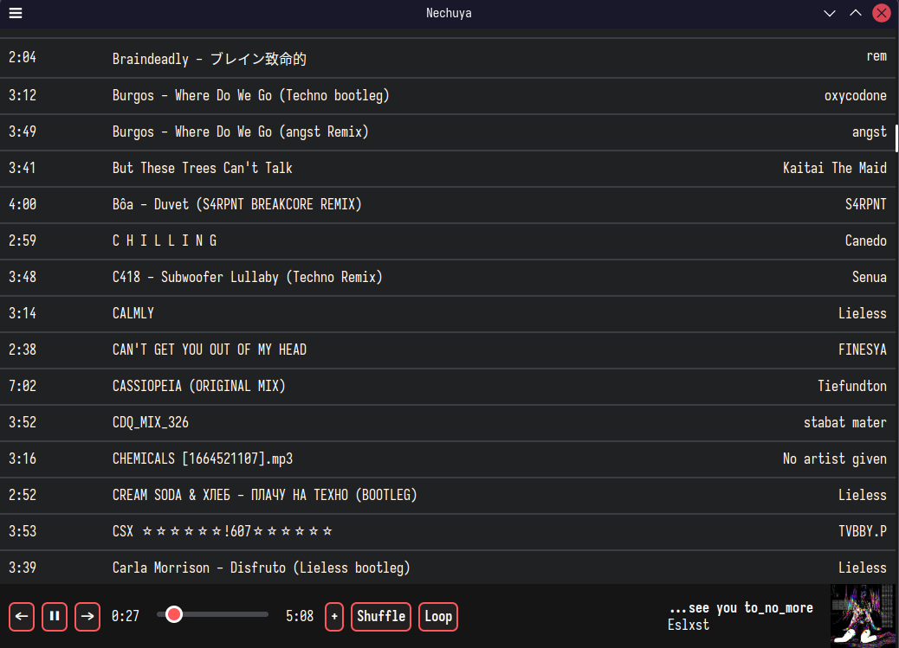

# Nechuya
A music player made using Electron/JavaScript.
This was made primarily so I could learn how to use JavaScript.

### Current features:
- Shuffling
- Looping songs

### What's with the name?
It's a butchered, romanized version of "can't hear" in Bulgarian.
